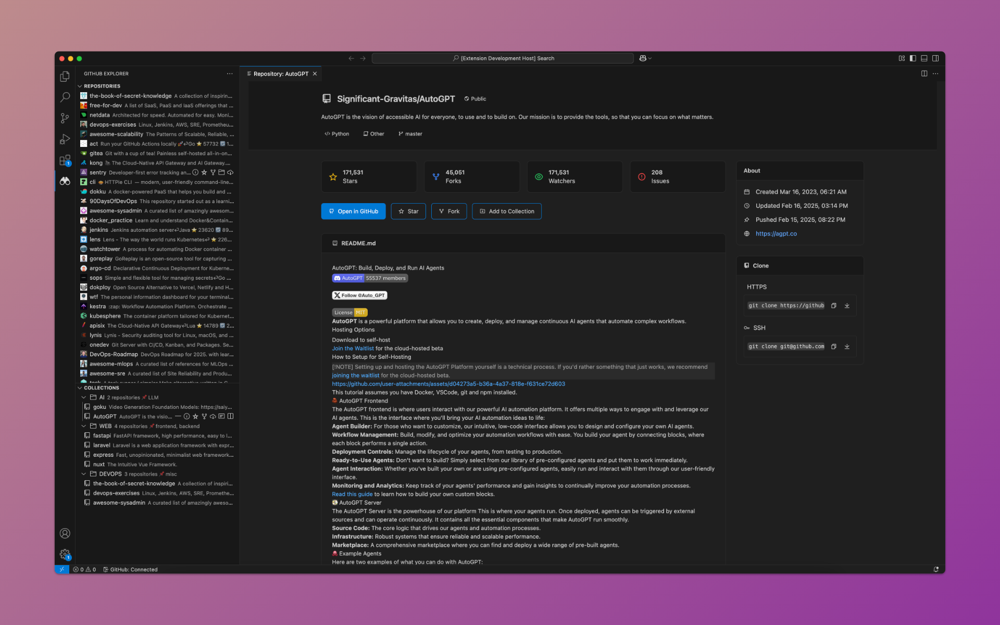
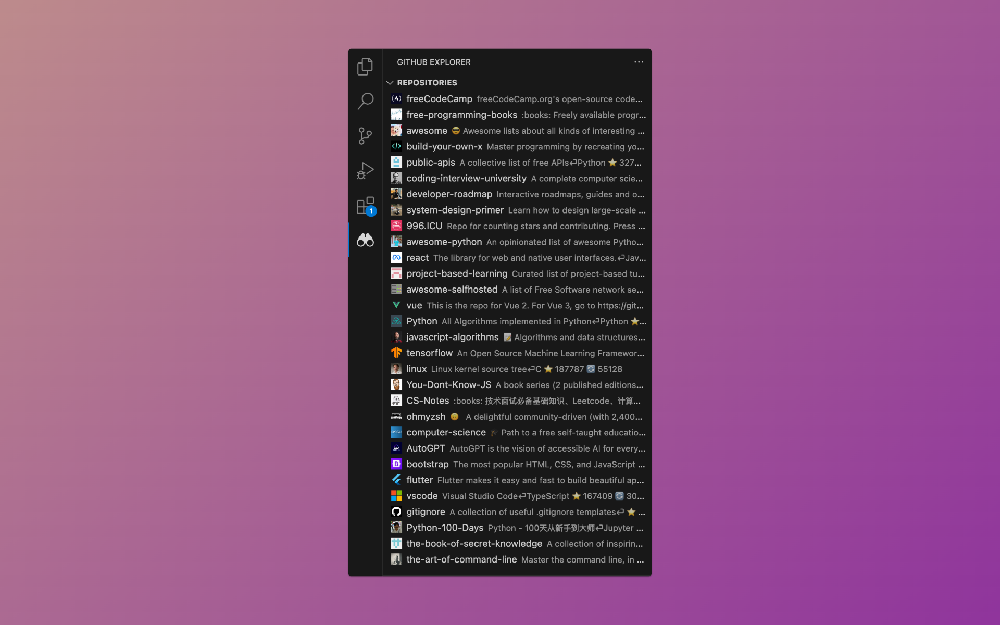
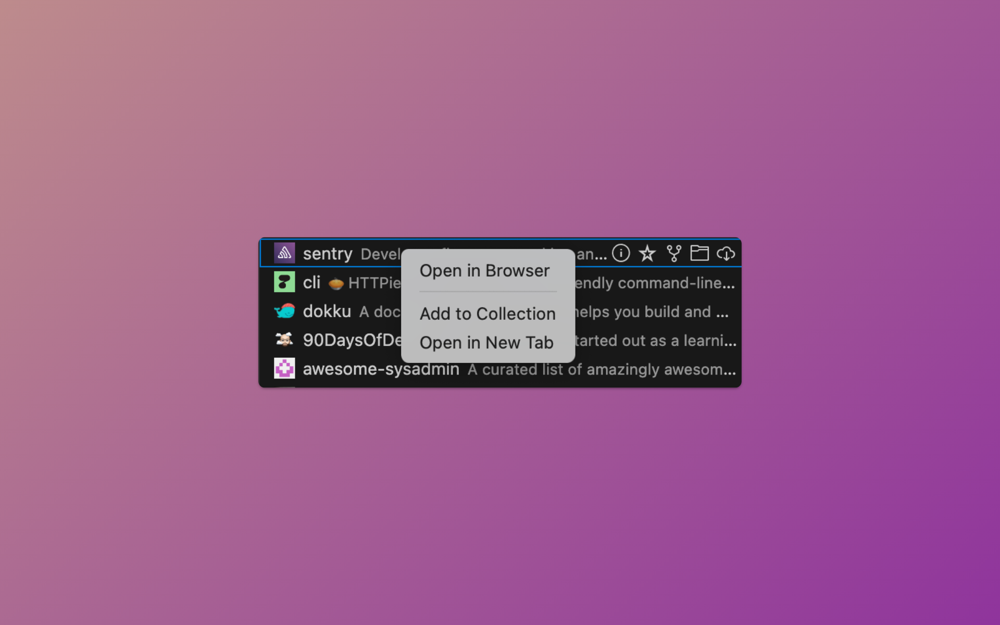
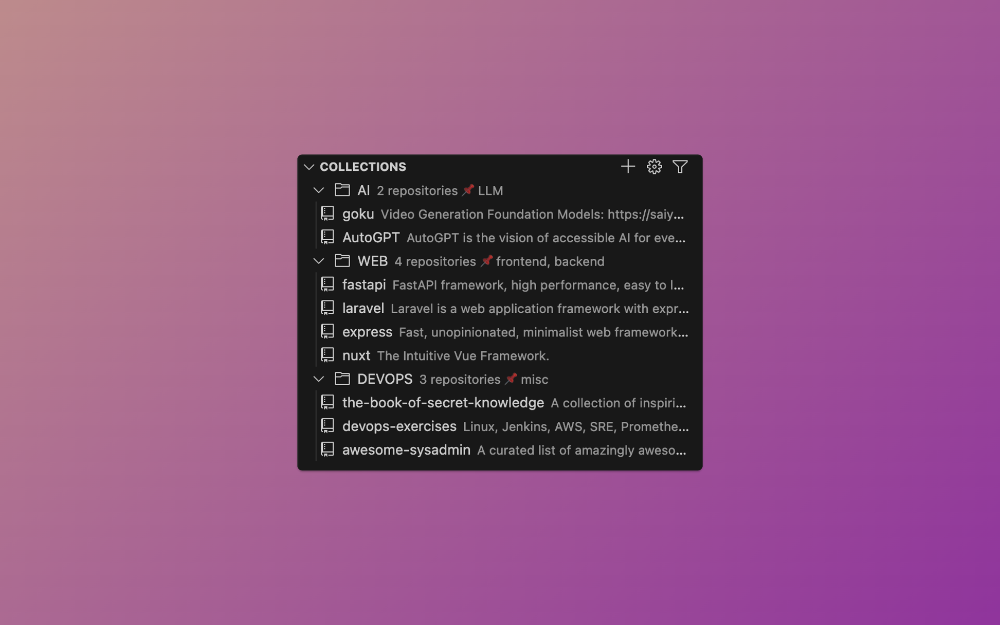
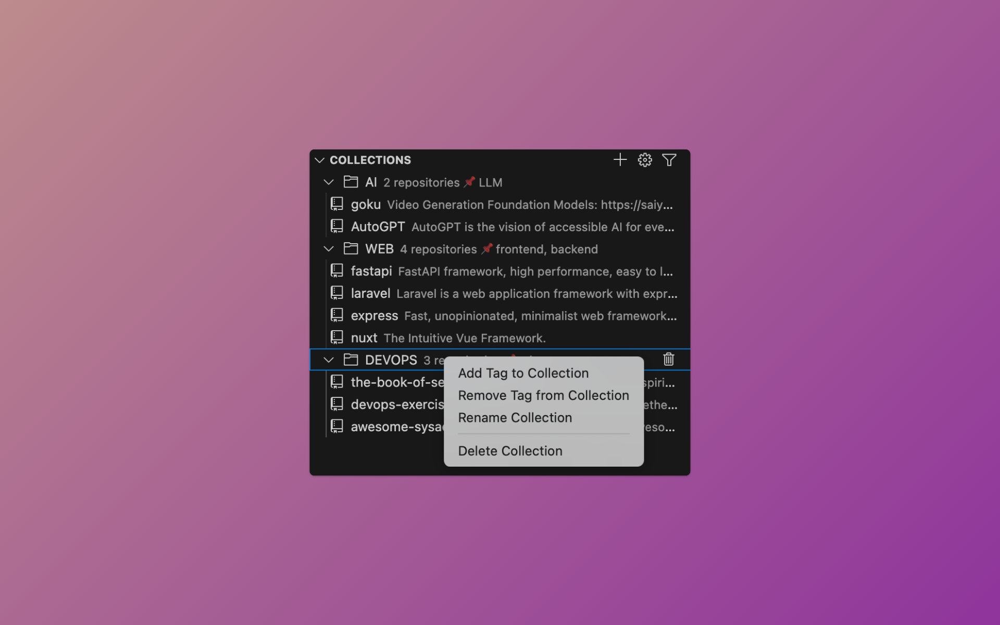
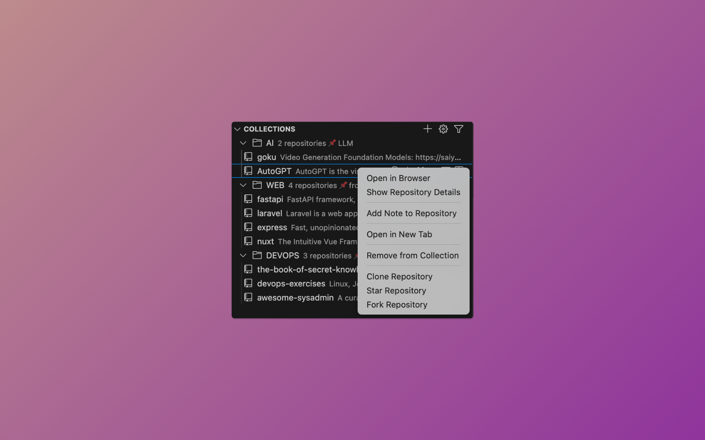
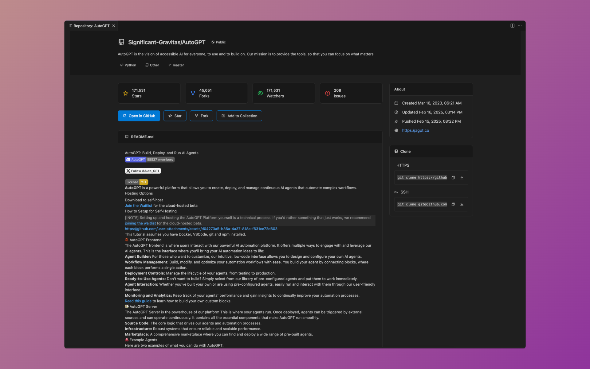
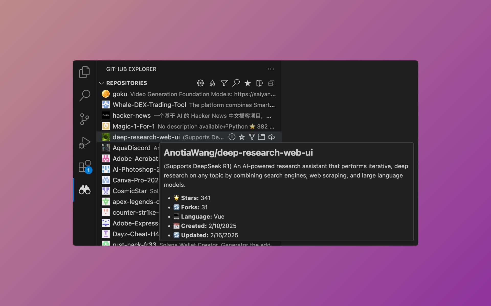

# OpenSource Explorer for VS Code

A powerful GitHub integration that brings repository management directly into your VS Code environment.



## What's New in 1.2.0 🎉

### Major Features
- **Enhanced Repository View**: New tabbed interface with Markdown support for READMEs
- **Smart Clone Commands**: Automatic `git clone` prefix and path memory
- **Improved Navigation**: Single-click details view and multi-tab support
- **Custom Clone Paths**: Configure default paths for repository cloning
- **Better Collection Management**: Enhanced organization and quick actions

### Improvements
- More intuitive repository details layout
- Smart path handling across platforms
- Enhanced error feedback
- Dynamic tab titles
- Better Markdown rendering

## Features Overview

### Core Features
- 🔍 Advanced repository search
- ⭐ Star/unstar repositories
- 🔄 Fork with one click
- 📥 Smart clone with path memory
- 📋 Quick copy clone commands
- 📂 Collection organization
- 🔄 Auto-refresh capability

### Smart Workflow
- Single-click repository details
- Multi-tab support for comparisons
- Configurable default clone paths
- Enhanced command copying
- Full Markdown README preview

### Collections
- Intuitive collection management
- Quick repository organization
- Favorite repositories access
- Bulk actions support

### Main Toolbar 🛠️
Quick access to essential actions like search, filter, and authentication.


- Search repositories globally
- Filter by language and stars
- Quick access to trending repositories
- Authentication controls
- Settings access

### Repository List 📋
Browse and interact with repositories efficiently.



- Clear repository information display
- Language detection
- Star and fork counts
- Repository visibility indicators
- Quick action buttons

### Quick Actions ⚡
Perform common operations directly from the list.



- Star/Unstar repositories
- Fork repositories
- Clone repositories
- Add to collections
- Open in browser
- View details

### Collections Management 📁
Organize repositories into personal collections.



- Create custom collections
- Add repositories from any view
- Quick access to favorite repos
- Organize by project or topic

### Collection Actions 🔄
Manage your collections efficiently.




- Rename collections
- Delete collections
- Add/Remove repositories
- Quick repository actions

### Repository Details 📊
Comprehensive repository information view.




- README preview
- Repository statistics
- Clone options (HTTPS/SSH)
- File structure
- Commit history
- Issues and PRs count

## Installation

1. Open VS Code
2. Quick Open (`Cmd+P` / `Ctrl+P`)
3. Run: `ext install SeanLuisGuadaRodriguez.opensource-explorer`

[VS Code Marketplace Link](https://marketplace.visualstudio.com/items?itemName=SeanLuisGuadaRodriguez.opensource-explorer)

## Configuration

### Basic Settings
```jsonc
{
    // Core Settings
    "opensource-explorer.autoRefresh": true,
    "opensource-explorer.refreshInterval": 300,
    "opensource-explorer.defaultClonePath": "/preferred/clone/path",

    // Display Preferences
    "opensource-explorer.showIssuesCount": true,
    "opensource-explorer.showLanguageIcons": true,
    "opensource-explorer.dateFormat": "medium",

    // Search Configuration
    "opensource-explorer.defaultSearchSort": "stars",
    "opensource-explorer.minStars": 10,
    "opensource-explorer.languageFilter": "",
    "opensource-explorer.trendingPeriod": "week"
}
```

### Custom Clone Path Setup
```typescript
// Set via command palette
vscode.commands.executeCommand('opensource-explorer.pickClonePath');

// Or configure directly in settings
"opensource-explorer.defaultClonePath": "/your/preferred/path"
```

## Practical Usage

### Quick Actions
1. **Repository Details**: Single click on repository
2. **Clone Repository**: 
   ```bash
   # Automatically copies with git clone prefix
   git clone https://github.com/user/repo.git
   ```
3. **Multi-tab Comparison**: Right-click → "Open in New Tab"
4. **Collection Management**: Right-click → "Add to Collection"

## Security Features

- Encrypted token storage
- Secure credential handling
- HTTPS enforcement
- Zero plain-text storage
- Session management

## Support & Issues

[Open an issue](https://github.com/SeanLuis/github-explorer/issues) for bug reports or feature requests.
